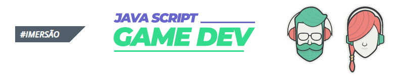

<!-- Badges session -->

  
  <!-- languages -->
  
  <!-- repo size -->
  
  <!-- last commit -->
  
  <!-- licence MIT -->
  

<!--Banner session-->

<!--About session-->
<h1 align="center">🎮 Imersão GameDev JavaScript 🧙‍♀️ Alura</h1>

Curso gratuito promovido pela Alura/Caelum quanto ao desenvolvimento de jogos em JavaScript. O curso foi ministrado em 5 vídeo-aulas ensinando os códigos, sprites, imagens dos personagens e sons do jogo (trilha, pulo, etc.)

Codificação realizada no [p5.js Web Editor](https://editor.p5js.org/) utilizando #JavaScript. Com a codificação apresentada, podemos utilizá-la para várias outros jogos.

Ao final da aula foi disponibilizado no GitHub, o certificado para o aluno realizar a alteração de seu nome e com o iframe do game desenvolvido.

<i>O jogo ainda possui algumas alterações que desejo realizar, como aumentar a vida a medida que a personagem percorre a a floresta, assim como mudar de cenário e incluir outros inimigos, etc.</i>

<h3><a href="https://abruxahipsta.vercel.app/">Jogo da Bruxa Hipsta</a></h3>

<!--  -->

<h3>Personagens do jogo: Hipsta, Gotinha, Gotinha Voadora, Troll</h3>

<h3>👨‍💻 Tecnologias utilizadas</h3>

- [HTML](https://developer.mozilla.org/en-US/docs/Glossary/HTML)
- [CSS](https://developer.mozilla.org/en-US/docs/Web/CSS)
- [JavaScript](https://developer.mozilla.org/en-US/docs/Web/JavaScript)

<h3>🚀 O que foi visto nas aulas</h3>

- <b>Aula 1 | <i>Animações básicas e trilha sonora</i></b>
	- Criado duas classes: Cenário, que refere-se apenas ao cenário, background do jogo e Personagem, que refere-se aos comandos da personagem;
	- Implementado o cenário a movimentação, dando a sensação de continuidade da floresta;
	- Implementado a personagem, bruxa Hipsta, e os comandos para animação dela correndo;
	- Implementado a trilha sonora do jogo.
  
- <b>Aula 2 | <i>Fluxo de vida, missão e falha</i></b>
	- Criado mais duas classes: Animacao, que refere-se a animação de todos os personagens do jogo e Inimigo, que refere-se a todos os inimigos do jogo;
	- Implementado o inimigo, a Gotinha, e a animação dela, que sempre virá em direção à Hipsta;
	- Implementado os comandos de colisão, Game Over, onde o jogo encerra quando à Hipsta encosta em seus inimigos;
	- Implementado os comandos de pulo e gravidade, e inserindo o som para o pulo.
  
- <b>Aula 3 | <i>Mais inimigos e pontuação</i></b>
	- Implementado mais dois inimigos: o Troll e a Gotinha Voadora;
	- Implentado a classe Pontuacao, score, onde será somado todas as pontuações no jogo;
  
- <b>Aula 4 | <i>Estado do jogo com cenas diferentes</i></b>
	- Organizado o código em arquivos Variavel.js (onde estão todas as variáveis utilizadas no jogo) e Loads.js (função preload para carregar todas os arquivos nas variáveis criadas);
	- Atualizado a frequência de carregamento e velocidade dos inimigos na tela;
	- Criado a Classe Jogo, arquivo jogo.js, onde implementamos todas os métodos utilizados no Jogo;
	- Criado a Classe TelaInicial, arquivo telaInicial.js, onde implementamos todos os cenários utilizados no jogo e a própria tela inicial;
	- Implementado o background da tela inicial, telaInicial.png;
	- Implementado o arquivo de fonte .otf para ser utilizada na tela inicial;
	- Implementado a classe Button, onde está codificado o botão para iniciar o jogo. Criado em uma classe a parte, pois assim pode ser chamada em outra tela do jogo, Game Over, por exemplo.
  
- <b>Aula 5 | <i>Vidas e mapa</i></b>
	- Criado a classe Vidas para calcular a quantidade de vezes que perdemos no jogo, com possibilidades de continuação;
	- Criado o mapa de inimigos, onde podemos quais inimigos devem aparecer, a velocidade e a quantidade máxima de vidas que a Hipsta deverá ter.

<!--License session-->
<h3>📝 Licença</h3>

Este projeto está sob a licença [MIT](./LICENSE).

<!--Bottom session-->
 <h4 align=center>Made with by Dayvidson Veiga</h4>
